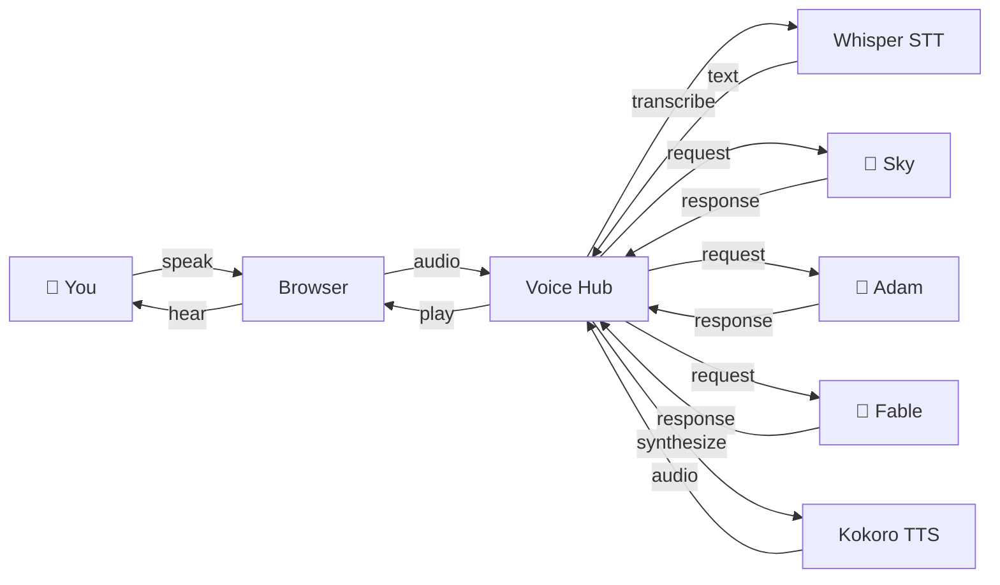

---
hide:
  - navigation
---

# For Humans

Voice Hub lets you talk to Claude Code with your voice. Run multiple voice agents from a single browser tab, each with their own voice and personality. Everything runs locally on your machine — no cloud audio processing.

## What You Get

- **Hands-free coding** — Describe what you want, Claude builds it. No typing.
- **Multiple agents** — Run several Claude sessions at once, each with a unique voice. Switch between them with tabs.
- **Full Claude Code power** — Each agent can read files, write code, run commands, search the web — everything Claude Code can do.
- **Private** — All speech-to-text and text-to-speech runs on your GPU. Audio never leaves your network.

## How It Works

You speak into your browser. The hub sends your audio to Whisper (running on your GPU) to turn it into text, then forwards it to the right Claude agent. Claude does the work — edits files, runs commands, whatever you asked — and responds. The hub sends that response to Kokoro (also on your GPU) to turn it into speech, and you hear it back. All local, all private.

## Prerequisites

You need a Linux machine with:

- **NVIDIA GPU** with at least 4 GB VRAM (for Whisper and Kokoro)
- **Claude Code** installed and authenticated
- **Tailscale** if you want to access from other devices (phone, laptop, etc.)

That's it. Your agent handles the rest.

## Install

The easiest way to install Voice Hub is to ask your Claude Code agent to do it:

> "Clone https://github.com/zeulewan/voice-chat.git, read the agent reference docs, check if my system is compatible, and install it."

Claude will:

1. Check your GPU and VRAM
2. Install Whisper STT and Kokoro TTS if needed
3. Clone the repo and set up the Python environment
4. Register the MCP server and slash commands
5. Set up Tailscale HTTPS if you want remote access

If anything is missing, Claude will walk you through it.

## Using It

1. Start the hub: `python hub.py` (from the voice-chat directory)
2. Open the URL in your browser
3. Click a voice card to start a session
4. Talk. Claude listens, works, and speaks back.
5. Say "goodbye" to end a session

## Controls

| Button | What it does |
|--------|-------------|
| **Record** | Start recording your voice |
| **Send** | Send your recording to Claude |
| **Interrupt** | Stop Claude mid-sentence and speak |
| **Cancel** (X) | Throw away your recording |
| **Mic Mute** | Mute your mic across all sessions |

| Toggle | What it does |
|--------|-------------|
| **Auto Record** | Start recording automatically after Claude speaks |
| **Auto End** | Stop recording automatically when you stop talking |
| **Auto Interrupt** | Interrupt Claude by speaking (no need to tap the button) |

| Dropdown | What it does |
|----------|-------------|
| **Voice** | Change what the agent sounds like |
| **Speed** | Make the agent talk faster or slower |

## Tips

- **Switch tabs** to jump between agents. Audio pauses when you leave and resumes when you come back.
- **Background work** — If an agent is talking while you're on another tab, the audio is saved and plays when you switch back.
- You can **attach to the tmux session** shown in the bottom bar to see what Claude is doing behind the scenes.
