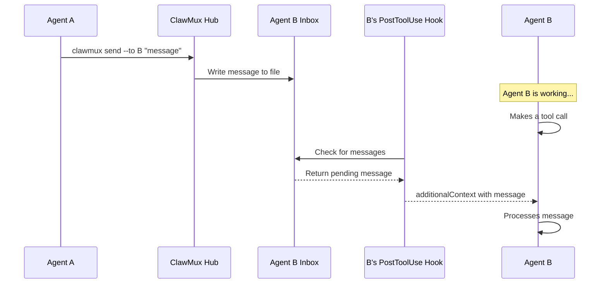

# v0.6.0 — Hook-Based Agent Communication

Replaced tmux-injection messaging with Claude Code hooks for reliable, event-driven agent communication. Shipped in v0.6.0.

## Problem (Solved)

The previous system injected messages via `tmux send-keys`. This was fragile:

- Special characters corrupted sessions
- Messages lost if agent was mid-output
- No delivery confirmation
- Race conditions with Ink's input handling
- Messages only arrived when the agent called `clawmux converse`

## Architecture

### Hook-Based Inbox Delivery

Each agent has an inbox file managed by the hub. Messages are delivered through Claude Code's official hooks system.

**PostToolUse / PreToolUse hooks** fire on every tool call. The hook checks the inbox and returns pending messages via the `additionalContext` JSON field (plain stdout is NOT fed to the model — only `additionalContext` reaches Claude's context window):

```json
{
  "hookSpecificOutput": {
    "hookEventName": "PostToolUse",
    "additionalContext": "[MSG id:msg-abc from:sky] Check the auth module"
  }
}
```

This gives **near-real-time delivery** — messages arrive within seconds during active work.

**Stop hook** fires when the agent tries to end its turn. If the inbox has messages, the hook exits with code 2 and writes the message to stderr, which Claude receives as an error and must process before stopping.

### Unified Input: `clawmux wait`

Replaced `clawmux converse ""` for listening. Watches **both** the microphone (voice input) and the inbox file simultaneously. Whichever arrives first unblocks the call — like `Promise.race()`.

```bash
# Block until voice input OR inbox message arrives
clawmux wait
```

### Unified Output: `clawmux send --to user`

All agent output goes through `send`. Speaking to the user is just messaging the special `user` target:

```bash
# Speak to the user via TTS
clawmux send --to user "I've finished the task."

# Message another agent
clawmux send --to alloy "Check the auth module"

# Acknowledge a message (bare --re, no content)
clawmux send --re msg-abc123

# Reply to a specific message
clawmux send --to sky --re msg-abc123 "Done, pushed to main."
```

### Hub as Message Broker

The hub manages all inbox files:

- Agents send messages via `clawmux send`
- Hub writes to the recipient's inbox file
- Hub handles serialization and file locking for concurrent writers
- Inbox files use atomic append with newline-delimited JSON

## Message Flow



## Commands

| Command | Replaced | Description |
|---|---|---|
| `clawmux wait` | `clawmux converse ""` | Block until voice or inbox message arrives |
| `clawmux send --to user "msg"` | `clawmux converse "msg" --no-listen` | Speak to user via TTS |
| `clawmux send --to user "msg"` then `clawmux wait` | `clawmux converse "msg"` | Speak and listen |
| `clawmux send --re <id>` | `clawmux ack <id>` | Acknowledge a message |
| `clawmux send --to X --re <id> "msg"` | `clawmux reply <id> "msg"` | Reply to a message |

## Deprecated Commands

The following commands were deprecated in favor of the unified `send`/`wait` model:

- `clawmux converse` → use `send --to user` + `wait`
- `clawmux ack` → use `send --re <id>`
- `clawmux reply` → use `send --to X --re <id> "msg"`
- `--wait-ack` flag → hub tracks delivery via hooks
- `--wait-response` flag → use message threading with `--re`

## Comparison: Before and After

| Feature | Before (tmux) | After (hooks) |
|---|---|---|
| Delivery mechanism | Keystroke injection | File-based inbox via hooks |
| Reliability | Fragile, could corrupt | Atomic file writes |
| Delivery timing | Only on `converse` | Every tool call |
| Message loss | Possible | None |
| Special characters | Needed escaping | No issues |
| Delivery confirmation | None | Hook-level acknowledgment |
| Official support | Unsupported hack | Claude Code hooks API |
| Voice + messaging | Separate systems | Unified through `send`/`wait` |

## Implementation Notes

- Inbox files at `/tmp/clawmux-inbox/<session_id>.jsonl`
- Hub writes messages as newline-delimited JSON with atomic append
- Hook reads and truncates inbox atomically
- PostToolUse hook is lightweight — file existence check only, no overhead when empty
- Stop hook ensures no messages missed at turn boundaries
- `clawmux wait` uses `inotify` on inbox file alongside microphone input
- `additionalContext` is the only reliable way to inject text into the model's context from PostToolUse hooks (plain stdout is display-only)

## Deferred Items

The following items from the original v0.6.0 scope were deferred to later releases:

- Drag-and-drop agent reordering
- Agent personality customization
- Sub-agent workers (spawn/terminate/message)
- iOS Live Activity revamp, STT edit, Action Button, Liquid Glass
- Public API with token auth
- Standalone STT/TTS installs

Project folders shipped in v0.5.x. See [Project Folders Spec](../reference/project-folders.md) for reference.
