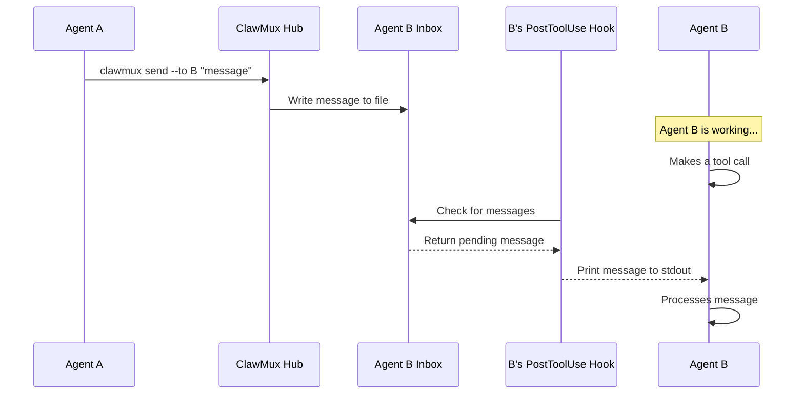

# v0.6.0 — Hook-Based Agent Communication

Replace the current tmux-injection messaging with Claude Code hooks for reliable, event-driven agent communication.

## Problem

The current system injects messages into agent sessions via `tmux send-keys`. This is fragile:

- Special characters can corrupt sessions
- Messages can be lost if the agent is mid-output
- No delivery confirmation
- Race conditions between keystroke injection and Ink's input handling
- Messages only arrive when the agent calls `clawmux converse` to listen

## Architecture

### PostToolUse Hook

Fires after every tool call. The hook checks an inbox file for pending messages and prints them to stdout. Claude Code receives hook output and processes it immediately.

This gives **near-real-time delivery** — messages arrive within seconds, whenever the agent makes any tool call (file reads, shell commands, etc.).

```
Agent working → tool call → PostToolUse fires → check inbox → message delivered
```

### Stop Hook

When the agent finishes its current task and tries to stop, the Stop hook fires. If the inbox has messages, the hook blocks the stop with the message content, forcing Claude to process it before going idle.

```
Agent finishing → Stop hook fires → inbox has message → block stop → agent processes message
```

### Unified Converse Listener

Enhanced `clawmux converse` watches **both** the microphone (voice input) and the inbox file simultaneously. Whichever arrives first unblocks the call — like `Promise.race()`.

```
Agent idle on converse → voice input OR inbox message → whichever comes first → return
```

### Hub as Message Broker

The hub manages all inbox files:

- Agents send messages via `clawmux send --to <agent> "message"`
- Hub writes to the recipient's inbox file
- Hub handles serialization and file locking for concurrent writers
- Inbox files are simple, atomic append operations

## Message Flow



## Benefits

| Feature | Current (tmux) | v0.6.0 (hooks) |
|---|---|---|
| Delivery mechanism | Keystroke injection | File-based inbox |
| Reliability | Fragile, can corrupt | Atomic file writes |
| Delivery timing | Only on `converse` | On every tool call |
| Message loss | Possible | None |
| Special characters | Need escaping | No issues |
| Delivery confirmation | None | Hook acknowledgment |
| Official support | Unsupported hack | Claude Code hooks API |

## Implementation Notes

- Inbox files stored at a known path per session (e.g., `/tmp/clawmux-inbox/<session_id>`)
- Hub writes messages as newline-delimited JSON
- Hook reads and truncates inbox atomically
- PostToolUse hook is lightweight — simple file existence check, no overhead when inbox is empty
- Stop hook ensures no messages are missed when agent goes idle
- Converse dual-listener uses `inotify` or polling on the inbox file alongside microphone input
